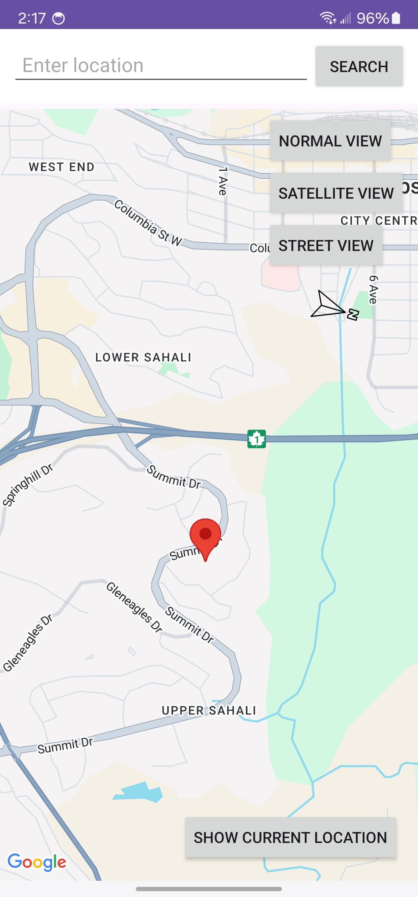
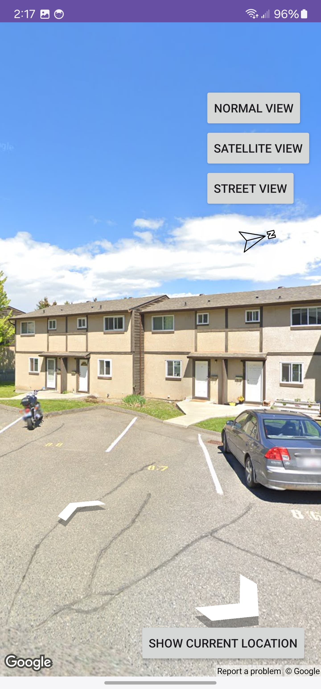
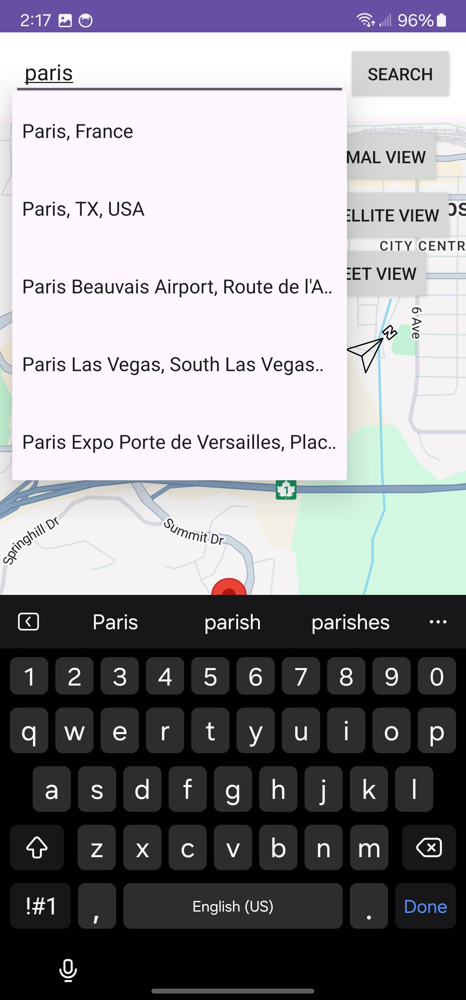

# Map Demo Project

The **Map Demo Project** is an Android application showcasing the integration of Google Maps API. This project demonstrates how to add maps to an Android app, interact with map features, and use various mapping functionalities.

## About the Project

This project was created to:
- Demonstrate the usage of the Google Maps API in Android development.
- Explore features such as markers, location tracking, and map customization.
- Provide a simple and interactive app for learning map-based application development.

## Features
- **Interactive Map**:
  - Displays a map with zoom and pan capabilities.
- **Markers**:
  - Add and manage markers on the map for specific locations.
- **Location Tracking**:
  - Tracks and displays the user's current location (if permissions are granted).
- **Customizable Map Types**:
  - Switch between map views such as Normal, Satellite, Terrain, and Hybrid.

## Screenshots






## Technologies Used
- **Java**
- **Android Studio**
- **Google Maps API**
- **XML** for UI layouts

## How to Run the App
1. Clone the repository:
   ```bash
   git clone https://github.com/Raf1dhasan/Map.git
2. Open the project in Android Studio.
3. Sync the Gradle files to download dependencies.
4. Add your Google Maps API key in the google_maps_api.xml file.
5. Build and run the app on an emulator or a connected Android device.

## What I Did
- Integrated Google Maps API to display an interactive map.
- Implemented functionality to add and customize markers on the map.
- Added location tracking and handled runtime permissions.
- Added a search functionality to locate places on the map
- Designed a clean and user-friendly interface using XML.

## What I Learned
- Gained experience in working with Google Maps API.
- Improved skills in handling runtime permissions in Android.
- Learned how to customize map styles and manage markers programmatically.
- Enhanced understanding of location-based app development.

## Future Improvements
- Implement geofencing for specific areas.
- Add support for saving favorite locations and routes.
- Enhance the UI/UX with additional features like custom marker icons.
